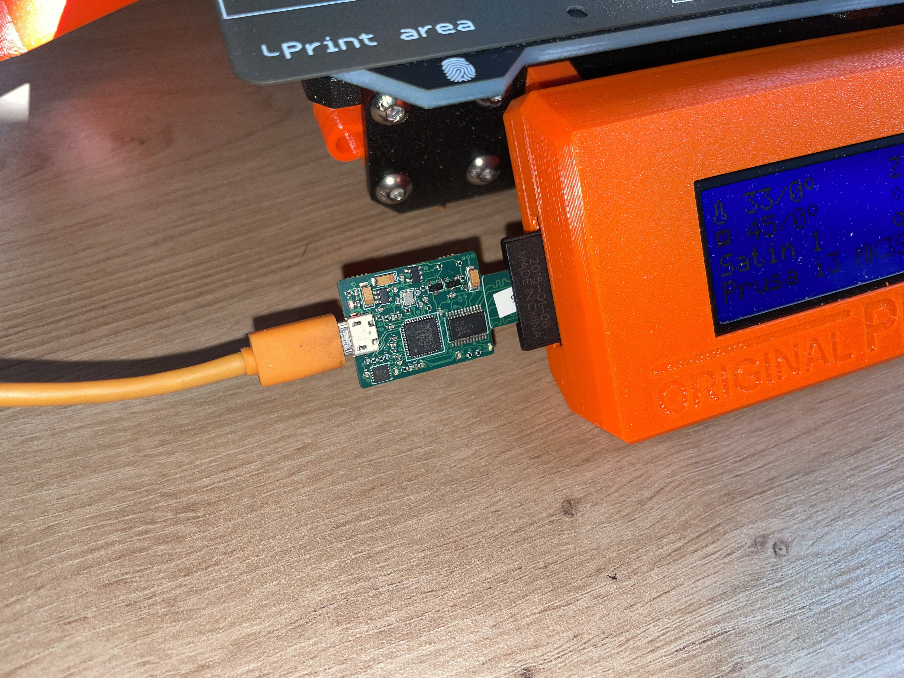

# OctoPrint-Sdwire

This plugin uses [sdwire hardware](https://3mdeb.com/shop/open-source-hardware/open-source-hardware-3mdeb/sdwire/)
to handle *fast* "Upload to SD".


`sdwire` is a device with *micro sd card* (inserted into it), *micro sd connector* (inserted into 3d printer) and a *micro USB
connector* to connect to host (like raspberry pi or other Linux based system).



3d printers (almost every commonly available 3d printer) use serial connection to host (over USB cable) which is very slow.
With sdwire inserted sd card can be made visible to the 3d printer or to the USB host (as regular usb-storage).
Copying to sd card from raspberry pi host using sdwire is fast (~10MB/s) compared to 115.2k serial port
(~3KB/s; serial port slowness and g-code protocol overhead).

## Numbers

Example uploading of `100MB .gcode` file to SD card.

### Upload to SD using sdwire hardware

Upload in octoprint consist of a few phases. When you click on `Upload to SD` what happens is:

* `Uploading` from computer to octoprint. In my case over wifi to raspberry 3B running octoprint - 27s
* `Saving` is when octoprint and installed plugins process uploaded file (depends on plugins etc) - 3s

Above phases are outside of `sdwrite` plugin control. Now `octoprint` activates `sdwire` plugin:

* `Streaming` phase (plugin will show `Uploading to sdwire` on progress bar) where sdwire hardware
  is switched from 3d printer to usb-storage, file is copied from octoprint disk (raspberry pi sd card)
  to sd card in 3d printer and finally sdwire hardware switches back to 3d printer - *14s*

### Upload to SD using serial port (over USB) without sdwire hardware

Most of popular 3d printers (like Prusa MK3S+) connect to octoprint host using 115.2k serial port (over USB). In such setup
'Uploading' and 'Saving' phases take the same time amount. Third 'Streaming' phase would take about *10 hours* to upload
100MB gcode file.

## Why uploading to sd card and not printing over USB?

With `Prusa MK3S+` and printing from octoprint over USB I was getting:
* layer shifts in random moments. Happened to me few times and also happens to other people (according to google search)
* g-code commands silently not executed (https://github.com/prusa3d/Prusa-Firmware/issues/3541)
* worse quality of prints (slightly but still). Probably due to latency issues over serial.

Other people reported slower printing times over USB than SD card:
* https://www.youtube.com/watch?v=vZbHGe4AOPg

These issues do not happen when printing from SD card.

## Setup

Install via the bundled [Plugin Manager](https://docs.octoprint.org/en/master/bundledplugins/pluginmanager.html)
or manually using this URL:

    https://github.com/arekm/OctoPrint-Sdwire/archive/master.zip

## Installation and configuration

### a. get and build sd-mux-ctrl binary on host machine (like raspberry pi)

* install libftdi 1.4 and popt development libraries

````
apt-get install libpopt-dev libftdi1-dev
````

* build sd-mux-ctrl binary

````
git clone https://git.tizen.org/cgit/tools/testlab/sd-mux
mkdir sd-mux/build && cd sd-mux/build && cmake ../ && make
````

* place `build/src/sd-mux-ctrl` binary in `/usr/local/sbin/sd-mux-ctrl` on your host machine (or in different location) or just run:

```
make install
```

### b. setup serial number for sd-wire device

* connect sd-wire device to host using micro-USB--USB cable
* check dmesg for output like:

````
[380920.237602] usb 1-1.2.2: New USB device found, idVendor=0403, idProduct=6015, bcdDevice=10.00
[380920.237620] usb 1-1.2.2: New USB device strings: Mfr=1, Product=2, SerialNumber=3
[380920.237628] usb 1-1.2.2: Product: FT200X USB I2C
[380920.237636] usb 1-1.2.2: Manufacturer: FTDI
[380920.237644] usb 1-1.2.2: SerialNumber: DP2W3TJ6
````

* check if sd-wire device is visible

````
sudo sd-mux-ctrl --list
````

If it is then output should look like:

````
Number of FTDI devices found: 1
Dev: 0, Manufacturer: SRPOL, Serial: sd-wire_11, Description: sd-wire
````

If it is not then you will get:

````
Number of FTDI devices found: 0
````

and you need to configure sdwire hardware:

````
sudo sd-mux-ctrl --device-serial=DP2W3TJ6 --vendor=0x0403 --product=0x6015 \
    --device-type=sd-wire --set-serial=sd-wire_11
````

where `device-serial`, `vendor`, `product` are values found in dmesg. `set-serial` is additional serial number you want to
assign to sdwire. This additional serial will be needed in _Sdwire_ _Settings_.

### c. Get UUID of micro sd card that is going to be used

Insert `micro sd card` into `sdwire` device, tell `sdwire` to provide sd card as usb-storage to the host:

````
sudo sd-mux-ctrl --device-serial=sd-wire_11 --ts
````

and see if sd card becomes available in your system by looking into `dmesg`:

````
[380921.032219] scsi 0:0:0:0: Direct-Access     Generic  Ultra HS-SD/MMC  1.76 PQ: 0 ANSI: 0
[380921.051231] sd 0:0:0:0: Attached scsi generic sg0 type 0
[380921.075036] sd 0:0:0:0: [sda] Attached SCSI removable disk
````

Get UUID of inserted sd card:

````
# blkid
[...]
/dev/sda1: UUID="5CB2-3D91" TYPE="vfat"
````

UUID (5CB2-3D91 in my case) will be needed in _Sdwire_ _Settings_.

### d. Set _Sdwire_ _Settings_

Go to _Settings_ and under _Plugins_ you will find a new entry _Sdwire_. Fill all options and also create /etc/sudoers.d/octoprint-plugin-sdwire on host as described there.

### e. Use plugin

Disconnect and connect printer from octoprint (optional, only after plugin installation - gets sdwire into consistent state) and you are ready to go.

Use `Upload to SD` `OctoPrint` functionality to test writting to sdwire sd card.


## Documentation and links
* [sdwire hardware](https://3mdeb.com/shop/open-source-hardware/open-source-hardware-3mdeb/sdwire/)
* [sdwire description](https://wiki.tizen.org/SDWire)
* [sd-mux-ctl software](https://git.tizen.org/cgit/tools/testlab/sd-mux/)
* [sdwire setup and usage](https://docs.dasharo.com/transparent-validation/sd-wire/getting-started/)
